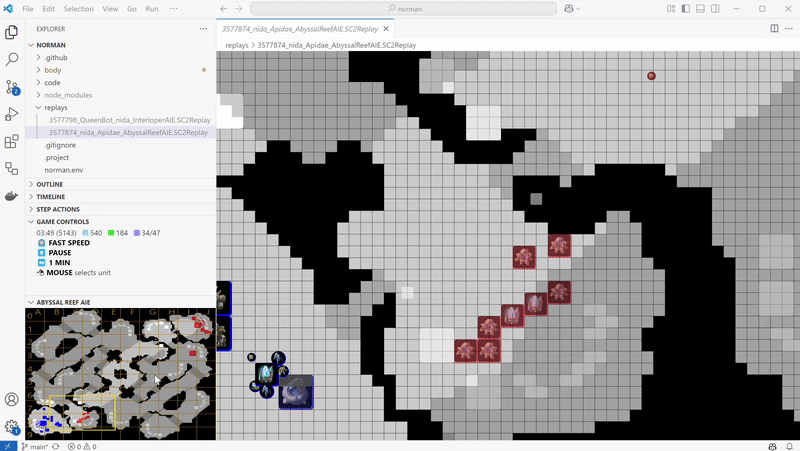

Stop a replay at any time point and continue the game with your bot playing against the computer:
* While watching a replay, press `⏸ PAUSE` to pause a replay at the desired time
* You can use `⏪ 1 FRAME` and `⏩ 1 FRAME` to move back and forward within 10 seconds before the time you paused the replay
* Press `🤖 BOTPLAY` to switch from replay mode to your bot playing
* Select the starting location for your bot (`Player 1` or `Player 2`)
* Select the difficulty level of the opponent computer
* Press `Start`. The game may need a few attempts to spawn the players at the desired starting locations. Be patient
* When you see "Wait for a bot to join the game", start your bot

