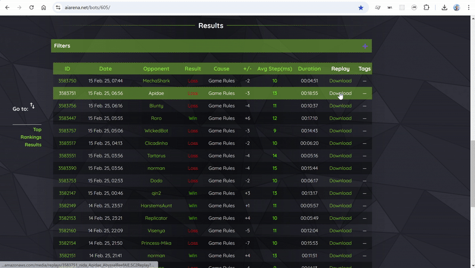

Watch a replay by opening its SC2Replay file.

You can watch only one replay file at a time.
If the replay doesn't start, check if all [pre-requisites](../Installation.md#prerequisites) are met.

Only replays on [supported maps](../index.md#Limitations) can be opened.

You can add replay files to the folder in VS Code and then watch them by selecting the files.

You can associate the file extension to VS code and then watch them by opening the file in your operating system.

